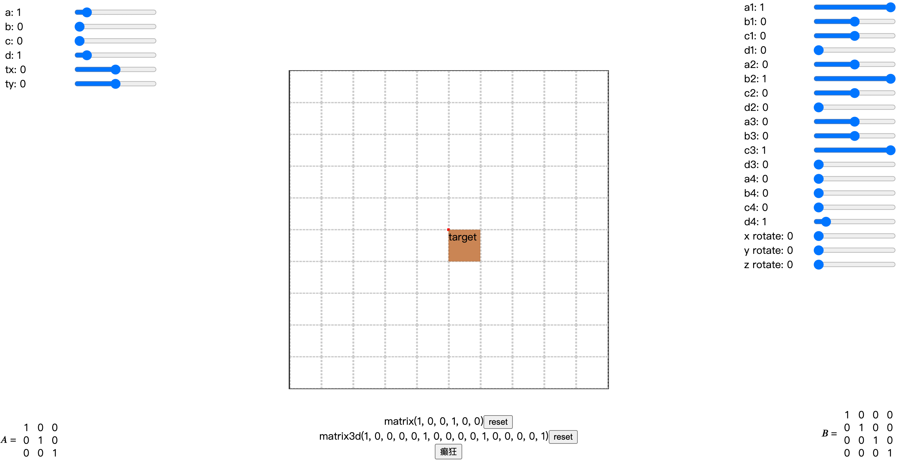

# matrix
Learning the matrix in CSS

## 指南

```
git clone https://github.com/handoing/matrix
cd matrix/
npm install
npm start
```

## 截图



## 演示文稿

[《The Matrix Resurrections​​​​​​​》](https://www.canva.cn/design/DAGUYVHPT-w/1eYwmUT0VeGczVKqZdssuQ/edit?utm_content=DAGUYVHPT-w&utm_campaign=designshare&utm_medium=link2&utm_source=sharebutton)
